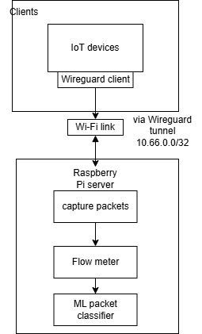

# WireGuard VPN Server with Real-Time Traffic Classification

A self-hosted [WireGuard](https://www.wireguard.com/) VPN gateway that classifies tunnelled
traffic **in real time** into application categories — `bulk`, `video`, `voip`, and `web` —
using a lightweight machine-learning model.

Packets on the `wg0` interface are grouped into bidirectional flows, summarised into 9
statistical features over sliding windows of 40 packets, and scored by a RandomForest model
exported to ONNX. Inference runs in a C++ capture app built on
[PcapPlusPlus](https://pcapplusplus.github.io/) and
[ONNX Runtime](https://onnxruntime.ai/).

## How It Works


The same feature-extraction logic exists twice and is kept in sync by design:

| Stage | Language | File |
| --- | --- | --- |
| Offline: parse pcaps → features | Python | [pcap_train/pcap_parser.py](pcap_train/pcap_parser.py) |
| Offline: train + export ONNX | Python | [pcap_train/train.py](pcap_train/train.py) |
| Online: live capture + inference | C++ | [main.cpp](main.cpp) |

### Extracted features (per 40-packet window)

`mean_sz`, `std_sz`, `min_sz`, `max_sz`, `mean_iat`, `std_iat`, `pps`, `bps`, `up_dn`
— packet-size stats, inter-arrival-time stats, packets/bytes per second, and the
upstream/downstream byte ratio.

## Repository Layout



```
main.cpp              # C++ live-capture + ONNX inference app
CMakeLists.txt        # Build config (Conan toolchain)
conanfile.txt         # C++ deps: onnxruntime, pcapplusplus
build.sh              # Conan install + CMake build (clang-17)
requirements.txt      # Python deps for the training pipeline
conf/wg0.conf         # Example WireGuard server config
pcap_train/           # Capture -> parse -> train -> export ONNX pipeline
  |- pcap_parser.py
  |- train.py
  \- README.md        # Full VPN setup + data-capture + training guide
```

## Prerequisites

- Linux host acting as the gateway (developed on a Raspberry Pi–class box)
- `wireguard`, `wireguard-tools`, `tcpdump`
- `clang-17` / `clang++-17` and CMake >= 3.13
- Python 3 with `venv`

## Setup

### 1. Bring up the VPN and train a model

Follow the full walkthrough in **[pcap_train/README.md](pcap_train/README.md)**, which covers:

1. Installing WireGuard and generating keys
2. Configuring the server ([conf/wg0.conf](conf/wg0.conf)) and clients
3. Capturing labelled pcaps (`web.pcap`, `voip.pcap`, `bulk.pcap`, `video.pcap`) on `wg0`
4. Training the classifier and exporting `model/model.onnx`

Set up the Python environment first:

```bash
python3 -m venv .venv
source .venv/bin/activate
pip install -r requirements.txt
```

Then train (expects labelled pcaps in `pcap_train/pcaps/`):

```bash
./pcap_train/train.py
```

This writes the model to `model/model.onnx`.

### 2. Build the C++ capture app

Conan resolves `onnxruntime` and `pcapplusplus`, then CMake builds `server_app`:

```bash
# with the .venv active (conan is installed via requirements.txt)
./build.sh
```

## Run

The app captures on the interface bound to `10.66.0.1` and loads `model/model.onnx`
relative to the working directory, so run it from the repo root. Live capture needs
elevated privileges:

```bash
sudo ./build/server_app
```
## Demo


